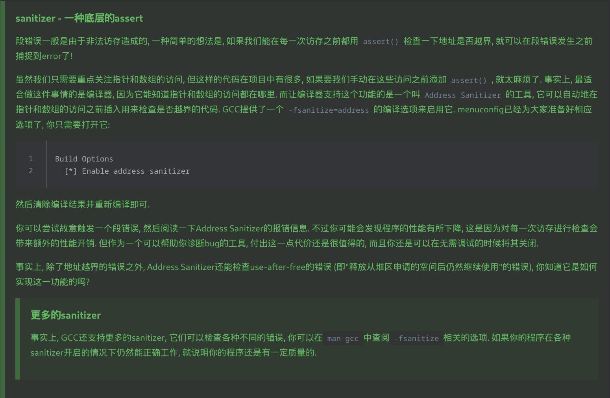

# NEMU

## 配置

首先需要运行`make menuconfig`进行[配置](https://docs.ysyx.org/ics-pa/1.3.html#%E9%85%8D%E7%BD%AE%E7%B3%BB%E7%BB%9Fkconfig), 将`Base ISA`设置为**riscv64**.

### 优化选项

- Build Options:
  - Enable link-time optimization: 启用链接时优化. 由于编译器一次只能看到一个编译单元因此无法跨文件范围优化 (如内联). 利用链接时的全局视角能进行更极致的优化. [建议生成release版时默认开启LTO](https://stackoverflow.com/questions/23736507/is-there-a-reason-why-not-to-use-link-time-optimization-lto).

### menuconfig中对调试有帮助的选项

- Build Options:
  - Enable debug information: 编译时添加GDB调试信息
  - Enable watchpoint value checking: 开启监视点值的检查. **会导致性能下降**.
  - Enable address sanitizer: 自动在指针和数组访问前插入用来检查是否越界的代码. **会导致性能下降**.
    

## 编译运行

运行`make run`编译并进入nemu的sdb, 如果想只编译不运行执行`make app`. 如果需要从命令行额外添加预处理宏, 比如调试`nemu/src/monitor/sdb/expr.c`用的`DEBUG_expr`, 设置到`CFLAGS`: `make run CFLAGS=-DDEBUG_expr`. 不过由于make大概率无法准确根据从命令行添加的宏判断需要重新编译哪些文件, 最好先`make clean`.

## sdb

sdb: **S**imple **D**e**B**uger

| 命令         | 格式       | 使用举例         | 说明                                                         |
| ------------ | ---------- | ---------------- | ------------------------------------------------------------ |
| 帮助         | `help`     | `help`           | 打印命令的帮助信息                                           |
| 继续运行     | `c`        | `c`              | 继续运行被暂停的程序                                         |
| 退出         | `q`        | `q`              | 退出NEMU                                                     |
| 单步执行     | `s [N]`    | `s 10`           | 让程序单步执行`N`条指令后暂停执行, 当`N`没有给出时, 缺省为`1` |
| 打印程序状态 | `i SUBCMD` | `i r`/`i w`     | 打印寄存器状态/打印监视点信息. 有别名`ir`和`iw`               |
| 扫描内存     | `x N EXPR` | `x 5 0x80000000` | 求出表达式`EXPR`的值, 将结果作为起始内存 地址, 以十六进制形式输出连续的`N`个8字节 |
| 表达式求值   | `p EXPR`   | `p *$t0 + 0x12`     | 求出表达式`EXPR`的值, 对于riscv64结果为`uint64_t`类型. `EXPR`支持的运算请见[下方BNF定义](#表达式求值接受的表达式的bnf定义) |
| 设置监视点   | `w EXPR`   | `w *0x2000`      | 当表达式`EXPR`的值发生变化时, 暂停程序执行                   |
| 删除监视点   | `d [N]`      | `d 2`            | 删除序号为`N`的监视点, 当`N`没有给出时, 删除所有监视点     |

### 表达式求值接受的表达式的BNF定义
```sh
<expr> ::= <decimal-number> # 十进制整数
  | <hexadecimal-number>    # 以"0x"开头的十六进制整数
  | <reg_name>              # 以"$"开头
  | "(" <expr> ")"
  | <expr> "+" <expr>
  | <expr> "-" <expr>
  | <expr> "*" <expr>
  | <expr> "/" <expr>
  | <expr> "==" <expr>
  | <expr> "!=" <expr>
  | <expr> "&&" <expr>
  | "*" <expr>              # 指针解引用
  | pc                      # 程序计数器PC
```

### 断点

- [断点的实现](https://ysyx.oscc.cc/docs/ics-pa/1.6.html#断点)

## nemu riscv64的实现

- [官方NEMU源代码概述](https://docs.ysyx.oscc.cc/ics-pa/1.3.html)

### 内存

nemu用一个`uint8_t`类型 (也就是一个元素就是一字节) 的大数组`pmem` (在`nemu/src/memory/paddr.c`中定义) 来实现128MB (由`CONFIG_MSIZE`给出) 物理内存, 对于riscv32/64, 物理地址从**0x80000000**开始编址 (由`CONFIG_MBASE`给出), 因此合法物理地址范围为`CONFIG_MBASE` <= paddr < `CONFIG_MBASE + CONFIG_MSIZE`.

💡 `make menuconfig`进入**Memory Configuration**可以将`pmem`的创建方式由全局数组改为`malloc()`, 来支持更大的内存. 不过由于默认开启了用随机数初始化内存 (有助于发现未定义行为), 用`malloc()`创建`pmem`会很耗资源 (主要被随机数消耗掉), 此时建议就用0初始化内存.

客户程序`image` (在`nemu/src/isa/riscv32/init.c`中定义) 被加载至`RESET_VECTOR` (= `CONFIG_MBASE + CONFIG_PC_RESET_OFFSET`), 同时`cpu.pc`被指向此地址. 因为大多数x86_64电脑 (比如我的笔记本) 都是[小端序](https://zh.wikipedia.org/wiki/%E5%AD%97%E8%8A%82%E5%BA%8F#%E5%B0%8F%E7%AB%AF%E5%BA%8F)的, 与riscv32/64的端序正相同, 因此以`RESET_VECTOR`开始的四条指令来举例的话:
```sh
127  inst4 96   inst3  64   inst2  32   inst1   0
  v         v           v           v           v
  01 02 b5 03 00 02 b8 23 00 02 b8 23 00 00 02 97
```
此时若用`vaddr_read(CONFIG_MBASE, 1)`读取一字节数据, 读到的是**0x97**, 而`vaddr_read(CONFIG_MBASE, 8)`读取一个字 (riscv64的字长为8字节, 即`word_t`类型), 读到的刚好是**0x0002b82300000297**. 因此按字节遍历时打出来的数相对于一个字来说是反的. RISCV32的指令长度是32位, 因此半字半字读.

### 寄存器

riscv64有32个64位寄存器 (在`nemu/src/isa/riscv64/include/isa-def.h`中定义, 实例为`cpu.gpr`), 寄存器名在`nemu/src/isa/riscv64/reg.c`中给出.

- riscv32/64的0号寄存器总是存放0.

### 指令周期

- [官方NEMU指令周期实现概述](https://ysyx.oscc.cc/docs/ics-pa/2.2.html#rtfsc-2)

指令周期: 在`exec_once()`中完成
1. **取指(instruction fetch, IF)**: `inst_fetch()` 本质就是一次内存的访问.
2. **译码(instruction decode, ID)**: `decode_exec()` 目的是得到指令的操作和操作对象. 💡 不同ISA的opcode会出现在指令的不同位置, 比如RISC-V指令集的opcode在指令最后 (高位在前).
3. **执行(execute, EX)**: 在`decode_exec()`中由`INSTPAT()`模式匹配来译码的同时就被执行了.
4. **更新PC**: 在`decode_exec()`中`s->dnpc` (dynamic next pc) 被赋值为 `s->snpc` (static next pc), 在执行完`isa_exec_once()`后立即`cpu.pc = s->dnpc`更新PC.

## 笔记

### 正则

此处正则匹配实现使用的是[POSIX风格](https://www.regular-expressions.info/posix.html)正则表达式 (可以`man 7 regex`查看详细说明), 因为在编译正则表达式时 (在`nemu/src/monitor/sdb/expr.c`的`init_regex()`中) 加了**REG_EXTENDED**标志, 因此确切说使用的是POSIX ERE (Extended Regular Expressions) 风格. 要注意POSIX风格中的字符类概念与其他风格中的字符类并不是同一概念. 其他风格中的[字符类](https://www.regular-expressions.info/charclass.html)是类似`[xz]`的东西, 这在POSIX中称为[括号表达式](https://www.regular-expressions.info/posixbrackets.html). 而POSIX中的[字符类](https://www.regular-expressions.info/posixbrackets.html#Character%20Classes)是在括号表达式里用的: `[xz[:digit:]]`, `[[:alpha:]]`. POSIX风格完全不支持[字符类简写](https://www.regular-expressions.info/shorthand.html), 也完全不支持[前瞻后瞻](https://www.regular-expressions.info/lookaround.html).

💡 Python的re模块使用的是PCRE风格.

#### 关于反斜杠

C中没有原生字符串 (raw string), 因此要匹配元字符本身或者转义字符时使用的字符串实际上需要多加一个`\`. 最极端的例子是匹配`\`, 需要用的字符串为`"\\\\"`. 过程是这样的: `"\\\\"` (字符串) --转义--> `\\` (正则表达式) --转义--> 匹配`\`. 同理, 想匹配`+`就需要字符串`"\\+"`, 而匹配`-`的话因为-不是元字符,就用`"-"`就行.

### 单链表

sdb中监视点 (`nemu/src/monitor/sdb/watchpoint.c`) 使用[单链表](https://akaedu.github.io/book/ch26s01.html#id2844144)实现.

### 杂

#### static关键字

在**C**中`static`主要功能只有两种:
1. 函数内的`static`变量: 用于在调用间保持变量值
2. 全局`static`变量/`static`函数: [赋予不希望被外界访问到的标识符Internal Linkage](https://akaedu.github.io/book/ch20s02.html#id2787367), 封装模块.

#### used attribute

```c
static int nr_token __attribute__((used))  = 0;
static int keep_this(int) __attribute__((used));
```

> This variable attribute informs the compiler that a static variable is to be retained in the object file, even if it is unreferenced. Static variables marked as used are emitted to a single section, in the order they are declared.

> This function attribute informs the compiler that a static function is to be retained in the object file, even if it is unreferenced. Functions marked with __attribute__((used)) are tagged in the object file to avoid removal by linker unused section removal.

这样一来即便编译器选项设置成有未引用变量/函数就报错, 用了这个属性就能正常保留.

#### noinline attribute

```c
__attribute__((noinline))
void check(bool cond) {
  if (!cond) halt(1);
}
```
> This function attribute suppresses the inlining of a function at the call points of the function.

用这个属性可以让函数不要被优化成inline, 在汇编里能有自己的段.

## Introduction

NEMU(NJU Emulator) is a simple but complete full-system emulator designed for teaching purpose.
Currently it supports x86, mips32, riscv32 and riscv64.
To build programs run above NEMU, refer to the [AM project](https://github.com/NJU-ProjectN/abstract-machine).

The main features of NEMU include
* a small monitor with a simple debugger
  * single step
  * register/memory examination
  * expression evaluation without the support of symbols
  * watch point
  * differential testing with reference design (e.g. QEMU)
  * snapshot
* CPU core with support of most common used instructions
  * x86
    * real mode is not supported
    * x87 floating point instructions are not supported
  * mips32
    * CP1 floating point instructions are not supported
  * riscv32
    * only RV32IM
  * riscv64
    * only RV64IM
* memory
* paging
  * TLB is optional (but necessary for mips32)
  * protection is not supported
* interrupt and exception
  * protection is not supported
* 5 devices
  * serial, timer, keyboard, VGA, audio
  * most of them are simplified and unprogrammable
* 2 types of I/O
  * port-mapped I/O and memory-mapped I/O
